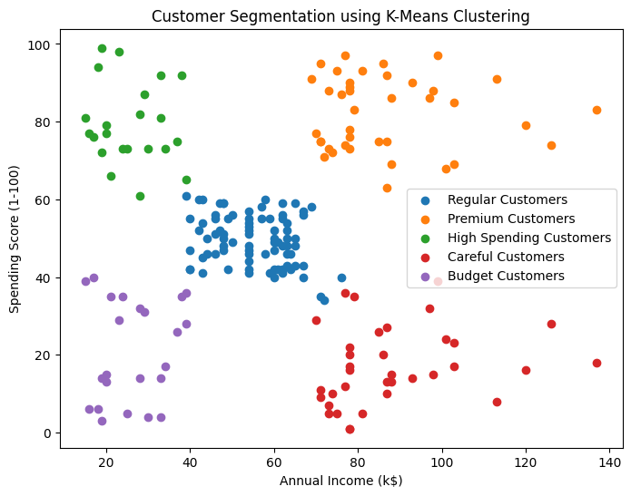

# Customer Segmentation using K-Means Clustering

## Project Overview
This project uses K-Means Clustering to segment customers based on their Annual Income and Spending Score. Customer segmentation helps businesses understand customer behavior and create targeted marketing strategies.

## Dataset Description
The dataset contains customer information collected from a shopping mall.

Features:
- CustomerID
- Gender
- Age
- Annual Income (k$)
- Spending Score (1-100)

Total Records: 200

## Technologies Used
- Python
- Pandas
- NumPy
- Matplotlib
- Scikit-learn
- Google Colab

## Methodology
1. Data Loading and Exploration
2. Data Cleaning and Analysis
3. Feature Selection
4. Elbow Method for Optimal Clusters
5. K-Means Clustering
6. Customer Segmentation Visualization

## Output

## Customer Segments
- Premium Customers
- Careful Customers
- High Spending Customers
- Budget Customers
- Regular Customers

## Evaluation
The Elbow Method was used to determine the optimal number of clusters. Five customer segments were successfully identified based on customer spending behavior.

## Conclusion
Customers were successfully grouped into five segments using K-Means Clustering. These insights can help businesses improve customer targeting and marketing strategies.
